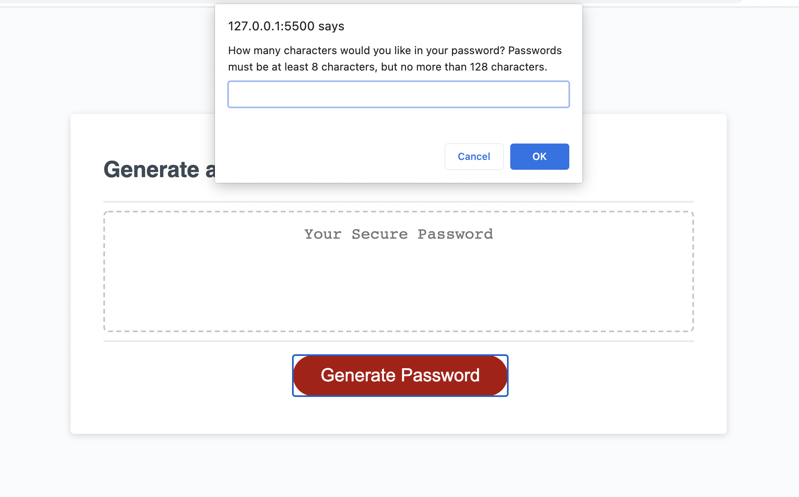
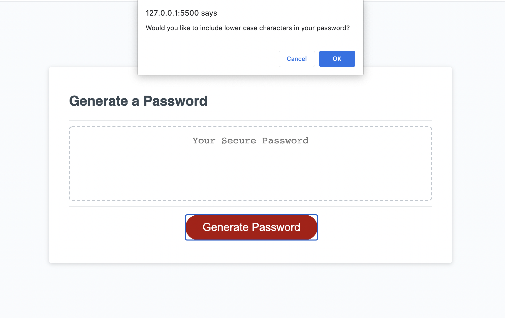
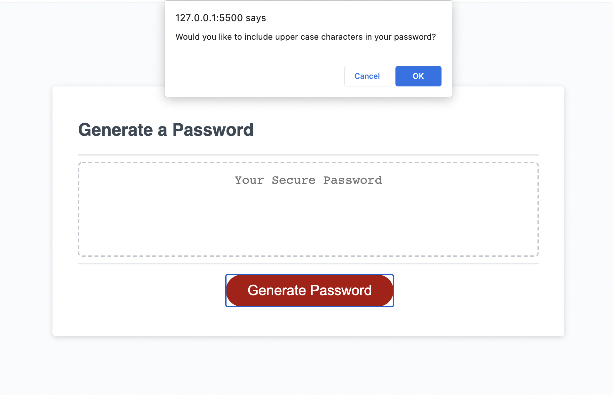
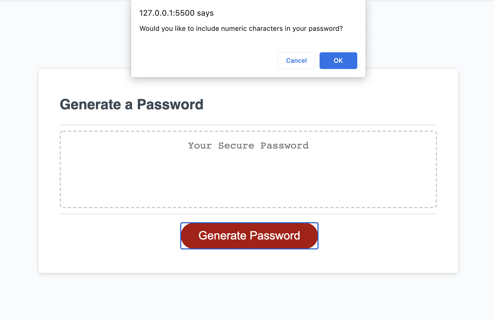
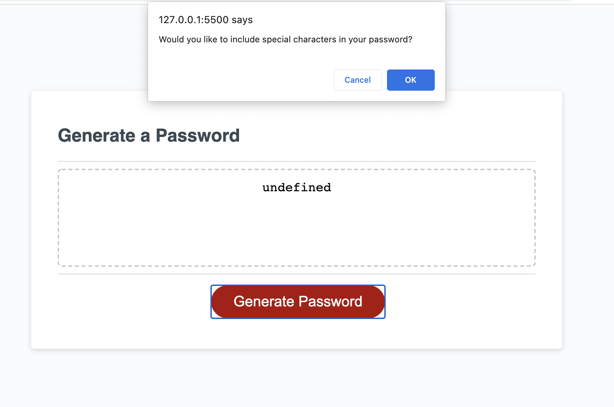
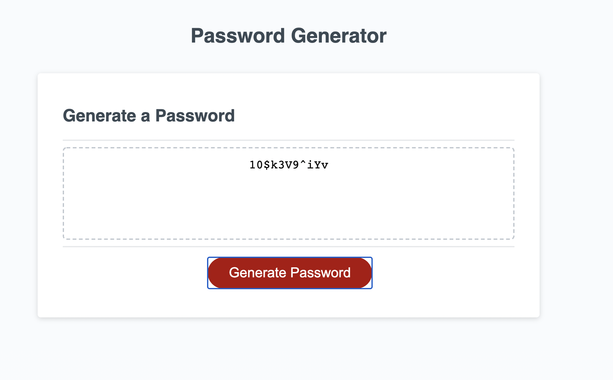

# Password Generator

## Description

I was tasked to create a random password generator using javascript, which allowed passwords to be created to meet certain user-specified criteria.

The first criterion was that the password had to be at least 8 characters, but no more than 128 characters, and the user had to specify a password length, between 8 and 128 characters. If the user did not specify a password length between 8 and 128 characters, the password would not generate.

The second criterion was that the password could contain lower case characters, upper case characters, numeric characters and special characters. The user had to select at least one of these character types for the password to be generated.

## What did I do?

- Created lower case, upper case, numeric and special character arrays, which would store all of the array items for the corresponding character type.
- Declared the password generator function
- Declared all necessary variables required for the password generator function
- Created a prompt dialogue box to allow the user to specify any password length between 8 and 128 characters
- Created an alert dialogue box which would display if the user did not specify a valid password length
- Created a series of confirm dialogue boxes to let the user confirm which character types they wanted to include in their password
- Created an alert dialogue box which would display if the user did not select at least one character type
- Created an options array which would contain all of the requested user character type items
- Used the math random math floor function to generate a random character from the options array and return a random choice
- Used a for loop to repeat the previous step, until enough random choices had been generated to fulfill the user-defined password length
- Used the join method to amalgamate these random characters into one password
- Finally the password will generate and display in the text box

## Screenshots

Link to Deployed Application:

https://gemmac-coder.github.io/Password_Generator/
